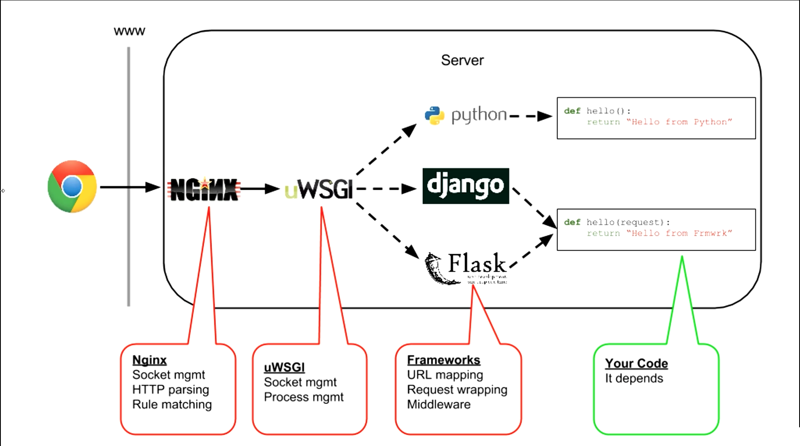
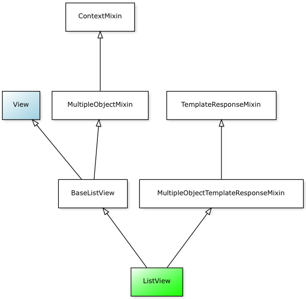
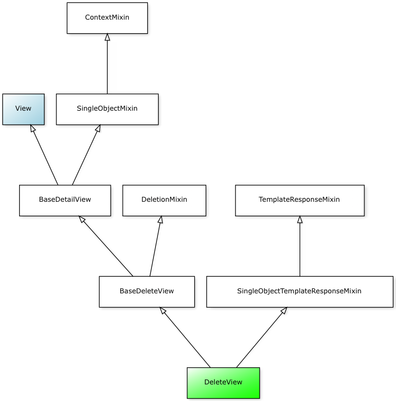
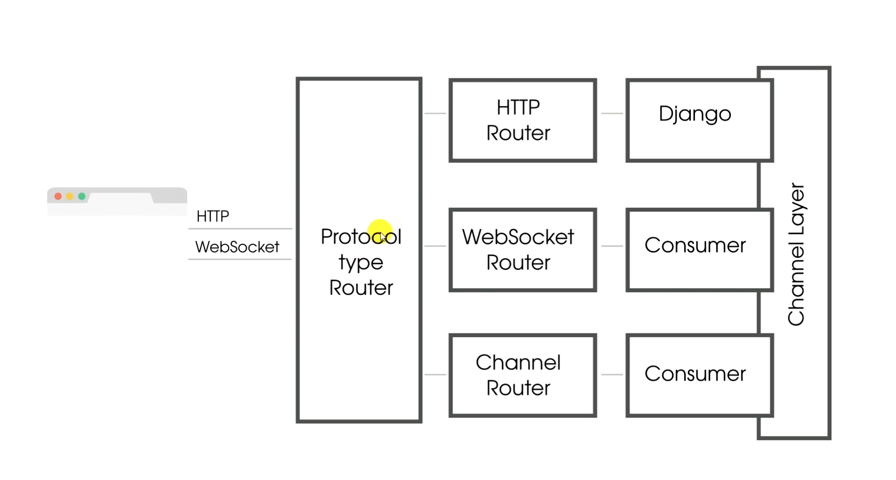
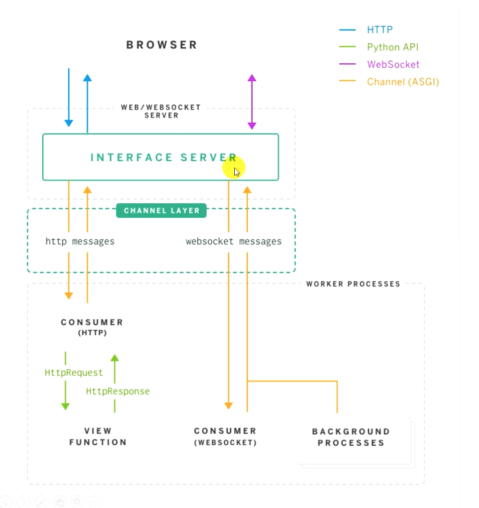
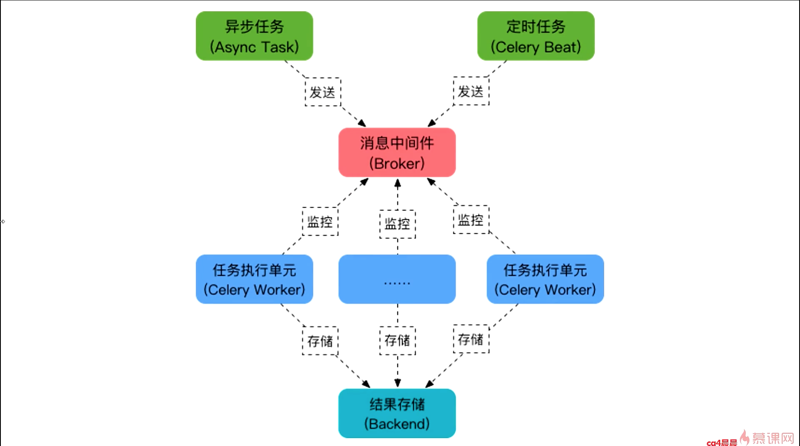
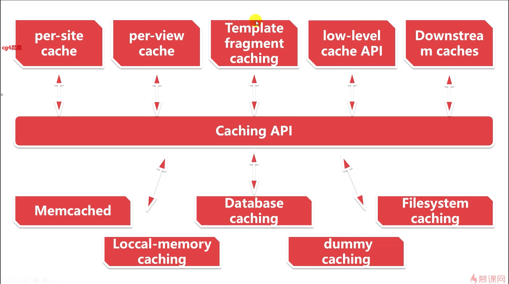

<div align="center">
  
</div>

> A Full Stack RESTful API Web Service for Q&A

[](https://github.com/pydanny/cookiecutter-django/) [](https://github.com/ambv/black) [](http://hits.dwyl.io/zhenye-na/thumbsup)

[TOC]

## 1. 项目部署

### Alibaba Cloud

Nginx, uWSGI, Daphne, and Supervisor

### Heroku

in progress

### Local

1. Install `Elasticsearch-2.4.6`

   ```bash
   # download
   $ wget https://download.elastic.co/elasticsearch/release/org/elasticsearch/distribution/tar/elasticsearch/2.4.6/elasticsearch-2.4.6.tar.gz
   
   # unzip
   $ tar -xf elasticsearch-2.4.6.tar.gz
   
   # run
   $ ./elasticsearch-2.4.6/bin/elasticsearch
   
   # to test elasticsearch is running properly
   $ curl http://localhost:9200
   ```

2. Install `Redis`

   ```bash
   # install
   $ wget http://download.redis.io/redis-stable.tar.gz
   $ tar xvzf redis-stable.tar.gz
   $ cd redis-stable
   $ make
   
   # run
   $ redis-server
   ```

3. Install dependencies

   ```
   $ pip install -r requirements.txt
   ```

4. Run

   ```bash
   $ python3 manage.py runserver
   ```


### 1.1. Python 项目部署原理

<div align="center">
  
  <p>Python + Nginx + uWSGI 部署流程示意图</p>
</div>


<div align="center">
  
</div>

- Nginx: 高性能的代理服务, 接受到客户端发送过来的 HTTP 请求和 WebSocket 请求, 响应静态文件请求和转发动态请求
- WSGI: 用在 Python Web 框架编写的应用程序与 Web 服务器之间的**规范** (本例就是 Django 与 uWSGI 之间)
- uWSGI: 是一个 Web 服务器, 它实现了 WSGI/uwsgi/HTTP 等协议, 勇于接受Nginx 转发的动态请求并处理后发给 Python 应用程序
- uwsgi: 是 uWSGI 服务器实现的独有**协议**, 用于 Nginx 服务与 uWSGI 服务的通信规范

## 2. 项目概况

<div align="center">
  
</div>


## 3. 业务需求

<div align="center">
  
</div>


### 3.1. 首页功能


 - 最上方有"发表动态"按钮，每页显示 20 条动态
 - 动态下有点赞和评论按钮
 - 每条动态除内容外要显示用户头像, 昵称, 发表时间, 赞和评论数量, 用户互动后能自动更新数量
 - 对于登录用户发表的动态，右上角显示删除按钮


#### 通用类视图


- Generic Detail
  - DetailView
- Generic Edit
  - CreateView
  - DeleteView
  - FormView
  - UpdateView
- Generic List
  - ListView


##### ListView


Django ListView 继承关系图


<div align="center">
  
</div>


MRO (Method Resolution Order), 定义了 Python 中多继承存在的情况下, 解释器查找函数解析的具体顺序 (C3 线性算法)


##### DeleteView


<div align="center">
  
</div>


### 3.2. 文章功能


- `django-contrib-comment` 实现评论功能
- `markdownx` 实现 markdown 实时预览
- `python-slugify` 创建文章 url 链接后缀
- `django-taggit` 创建文章中可以用逗号分隔的标签


### 3.3 问答功能


### 3.4. 点赞功能

Django ContentTypes 是由 Django 框架义工的一个核心功能, 对当前项目中所有基于 Django 驱动的 model 提供更高层次的抽象接口

ContentType 通用类型 - GenericRelation (通用外键关联)

这样就只需要在 `Vote` 这个 class 里面设置好 `content_type` 以及 `object_id` , 同时设置 `vote = GenericForeignKey()` 就可以免去在不同的表中 (问题, 动态, 评论) 重复创建 vote 表.


#### GenericRelation 和 GenericForeignKey


```python
from django.contrib.contenttypes.models import ContentType
from django.contrib.contenttypes.fields import GenericRelation, GenericForeignKey

# 在 Django 项目中找到对应的表
content_type = models.ForeignKey(ContentType, models.CASCADE)
object_id = models.IntegerField()

content_object = GenericForeignKey()
```


### 3.5. 私信功能

- 发送: Ajax POST 请求
- 接收: Websocket 请求

> WebSocket 允许服务端主动地向客户端发送数据, 在 WebSocket 协议中, 客户端浏览器和服务器只需一次握手就可以创建持久性的连接, 并在浏览器与服务器之间进行双向的数据传输 (全双工通信)

优点:

1. 支持双向通信, 实时性好
2. 数据格式轻量, 性能开销小, 通信高效
3. 支持扩展

缺点:

1. 浏览器是否支持不确定
2. 长连接对后端处理业务代码稳定性要求更高, 后端推送相对复杂
3. 组件比较少


WebSocket 请求头中重要的字段

- Connection 和 Upgrade: 表示客户端发起的是 Websocket 请求, 先用 HTTP 协议发送 GET 请求, 然后 Upgrade 成 WebSocket 协议
- Sec-Websocket-Version: 客户端使用的 WebSocket 协议版本号, 服务端会确认是否支持该版本
- Sec-Websocket-Key: 一个 Base64 的随机编码值, 浏览器随机生成, 用于升级 request

WebSocket 响应头中重要的字段

- HTTP/1.1 101 Switching Protocols: 切换协议, WebSocket 协议通过 HTTP 协议来建立运输的 TCP 链接, statuscode 101
- Connection 和 Upgrade: 表示服务端返回 WebSocket 响应
- Sec-WebSocket-Accept: 表示服务端接受了客户端的请求, 由 Sec-Websocket-Key 计算得来


需要解决的问题

1. 如何分别路由的 HTTP 请求和 WebSocket 请求
2. 如何兼容 Django 认证系统
3. 如何接受, 推送 WebSocket 消息
4. 如何通过 ORM 保存和获取数据

所以我们使用 Django-Channels


#### Django-Channels 原理

为 Django 提供异步扩展的库, 通常主要用来提供 WebSocket 支持和后台任务

<div align="center">
  
</div>


##### Django-Channels 架构


<div align="center">
  
</div>


一共三层

1. 第一层 - 接口服务器 (Interface Server): 负责对协议进行解析, 将不同协议进行解析, 将不同协议分发到不同的 Channel
2. 频道层 (Channel Layer): 可以是 FIFO 队列, 通常使用 Redis
3. 消费者 (Consumer): 接受处理消息

#### WSGI 和 ASGI

- WSGI (Python Web Server Gateway Interface): 为 Python 语言定义的 Web 服务器和 Web 应用程序或框架之间的一种简单而通用的接口
    - Nginx + uWSGI + Django/Flask (HTTP / HTTP 2)
- ASGI (Asynchronous Server Gateway Interface): 异步服务网关接口, 一个介于网络协议服务和 Python 应用之间的标准接口, 能够处理多种通用的协议类型. 如 HTTP HTTP2 和 WebSocket
    - Nginx + Daphne + Django/Flask (HTTP / HTTP 2)
- WSGI 和 ASGI 区别: WSGI 是基于 HTTP 协议模式, 不支持 WebSocket, 而 ASGI 就是为了支持 Python 常用的 WSGI 所不支持的协议标准. ASGI 是 WSGI 的扩展, 同时可以通过 asyincio 异步运行


### 3.6. 通知功能

当其它用户与我有如下互动时能接收到通知:

1. 赞了我的状态
2. 评论了我的动态或文章
3. 收藏了我的文章
4. 回答了我的提问
5. 接受了我的回答
6. 回复了我的评论


所以我们可以创建一个通知处理器, 来更方便的管理处理通知

```
刘看山 点赞了   我的       文章
actor verb recipient action_object
```


### 3.7. 评论功能

使用 `django-comments` 信号机制实现文章评论, 同时可以实现解耦

一共有 3 种信号机制可以使用

- `comment_will_be_posted`
- `comment_was_posted`: send just after the commetn is saved
- `comment_was_flagged`


同步的 pub + sub (观察者模式)


### 3.8. 全站搜索

- Elasticsearch: 分布式可扩展的实时搜索和分析引擎
  - 实时分析的分布式搜索引擎
  - 分布式实时文件存储, 并将没一个字段编入索引, 使其可以被搜索
  - 可以扩展到上百台服务器, 处理 PB 级别的结构化或非结构化数据
  - ES 服务 -> 索引库(可以是多个) -> 类型(多种) -> 文档(行) -> 字段
  - "面向文档的数据库"
- django-haystack: 为 Django 项目提供了模块化的搜索


为各个模型类创建索引库: 先开启 Elasticsearch 服务 (切换至非 root 用户)

```
python manage.py rebuild_index
```

同时可以使用 `django-haystack` 的实时信号处理器, 会实时更新索引

```python
HAYSTACK_SIGNAL_PROCESSOR = 'haystack.signals.RealtimeSignalProcessor'
```


## 4. 网站优化

### 4.1. 使用 `django-compressor` 压缩静态文件

#### 4.1.1. 更改 `production.py` 文件配置

```python
# django-compressor
# ------------------------------------------------------------------------------
# https://django-compressor.readthedocs.io/en/latest/settings/#django.conf.settings.COMPRESS_ENABLED
COMPRESS_ENABLED = env.bool("COMPRESS_ENABLED", default=True)
# https://django-compressor.readthedocs.io/en/latest/settings/#django.conf.settings.COMPRESS_URL
COMPRESS_URL = STATIC_URL
```


#### 4.1.2. 手动压缩

```
python manage.py compress --force
```


### 4.2. 使用 `Celery` 异步发送邮件

使用场景: 注册用户后要等邮件发送完成后才能跳转页面


#### 4.2.1 Celery 简介

分布式任务队列

消息中间件 (Broker): 任务调度队列, 接受生产者发送过来的任务


<div align="center">
  
</div>


#### 4.2.2 django-celery-email

Django 里使用 Celery 异步发送邮件


### 4.3. Django 缓存优化之 Redis 缓存

缓存结构


<div align="center">
  
</div>


Session 缓存

```python
SESSION_ENGINE = 'django.contrib.sessions.backends.cached_db'
```

使用 `cached_db` 仅仅使用 `cache`, 关机就没了


缓存文章创建页面

```python
@method_decorator(cache_page(60 * 60), name='get')
class ArticleCreateView(LoginRequiredMixin, CreateView):
    pass
```


缓存导航栏

```jinja2

  <nav>...</nav>

```


### 4.4. ORM 语句和 SQL 优化

- 设置数据库持久连接
- 合理的创建索引
- 减少 SQL 语句的执行次数
- 仅获取所需要的字段数据
- 使用批量创建, 更新和删除; 不随意对结果排序


#### 4.4.1. 设置数据库持久连接

```python
DATABASES["default"]["CONN_MAX_AGE"] = env.int("CONN_MAX_AGE", default=60)
```

当第一次 request 传过来, 执行 sql 语句, 会去连接数据库, 但是在之后 60s 以内, 不会断开数据库连接. 但是也不能太久


#### 4.4.2. 合理的创建索引

索引会占据磁盘空间

主键, 外键, 唯一键会自动创建索引


如何添加索引?

```python
db_index=True
```


添加索引的一些经验

1. 频繁出现在 `where` 条件子句的字段
2. 经常被用来分组 `group by` 或者排序 `order by` 的字段
3. 用于连接的列(主键/外键)上建立索引 `index_together`
4. 在经常存取的多个列上简历复合索引, 但要注意复合索引的建立顺序要按照使用的频度来确定


#### 4.4.3. 减少 SQL 语句的执行次数

方法

- `select_related()` 适用于 ForeighKey 或者 OneToOneField
- `prefetch_related()` 适用于 ManyToManyField 或者 GenericForeignkey


#### 4.4.4. 仅获取所需要的字段数据

- `defer()` 不需要获取的字段
- `on()` 需要获取的字段


#### 4.4.5. 使用批量创建, 更新和删除; 不随意对结果排序

`bulk_create()`


***

<div>Icons made by <a href="https://www.flaticon.com/authors/freepik" title="Freepik">Freepik</a> from <a href="https://www.flaticon.com/" title="Flaticon">www.flaticon.com</a> is licensed by <a href="http://creativecommons.org/licenses/by/3.0/" title="Creative Commons BY 3.0" target="_blank">CC 3.0 BY</a></div>