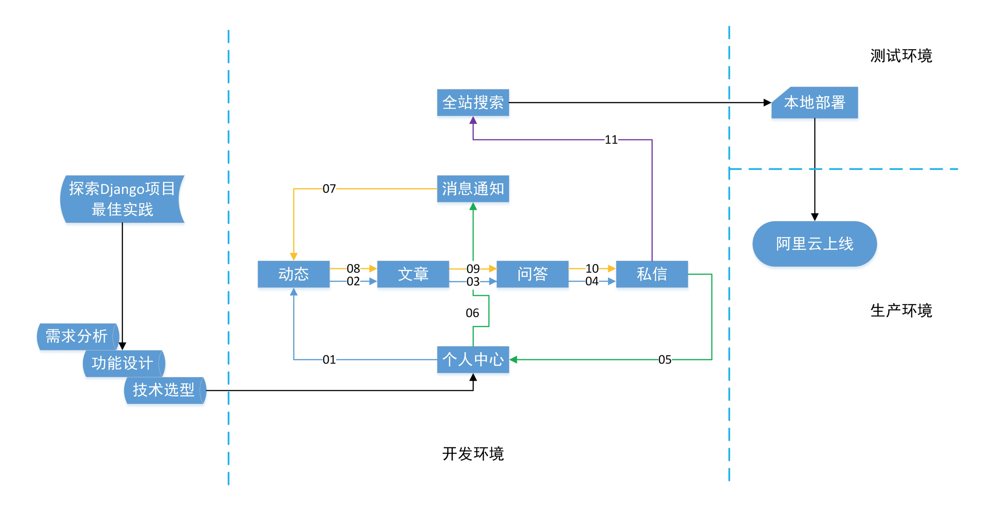
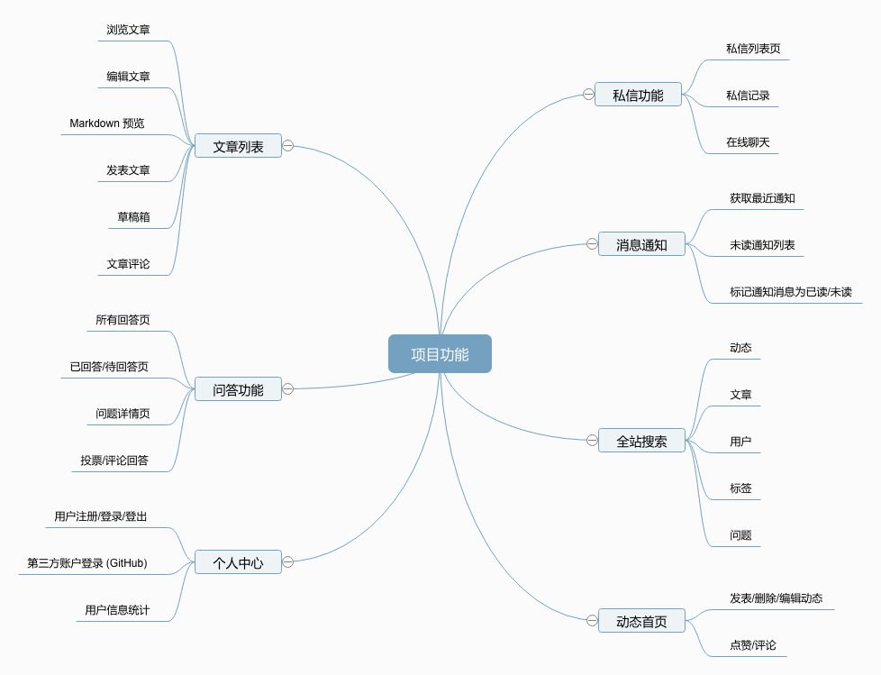

# Thumbs Up

<div align="center">
  
</div>

> A Full Stack RESTful API Web Service for Q&A

[](https://github.com/pydanny/cookiecutter-django/) [](https://github.com/ambv/black)

## Deployment

### Aliyun

Demo [here](http://47.88.53.242). But it is unstable based on Aliyun's Official Docs.

### Local

1. Install `Elasticsearch-2.4.6`

   ```bash
   # download
   $ wget https://download.elastic.co/elasticsearch/release/org/elasticsearch/distribution/tar/elasticsearch/2.4.6/elasticsearch-2.4.6.tar.gz
   
   # unzip
   $ tar -xf elasticsearch-2.4.6.tar.gz
   
   # run
   $ ./elasticsearch-2.4.6/bin/elasticsearch
   
   # to test elasticsearch is running properly
   $ curl http://localhost:9200
   ```

2. Install `Redis`

   ```bash
   # install
   $ wget http://download.redis.io/redis-stable.tar.gz
   $ tar xvzf redis-stable.tar.gz
   $ cd redis-stable
   $ make
   
   # run
   $ redis-server
   ```

3. Install dependencies

   `pip install -r requirements.txt `

4. Run

   `python3 manage.py runserver`

## Requirements

```
python-slugify==3.0.1
redis==3.2.1
celery==4.3.0rc3
django-celery-email==2.0.1
daphne==2.2.5
django==2.1.7
django-redis==4.10.0
django-allauth==0.39.1
django-environ==0.4.5
django-crispy-forms==1.7.2
django-compressor==2.2
mysqlclient==1.4.2.post1
django-contrib-comments==1.9.1
django-markdownx==2.0.28
channels==2.1.7
sorl-thumbnail==12.5.0
django-taggit==1.1.0
channels-redis==2.3.3
awesome-slugify==1.6.5
argon2-cffi==19.1.0
pillow==5.4.1
python3-openid==3.1.0
requests-oauthlib==1.2.0
requests==2.21.0
django-haystack==2.8.1
elasticsearch==2.4.1
uwsgi==2.0.18
```


## Introduction




## Support Features




***

<div>Icons made by <a href="https://www.flaticon.com/authors/freepik" title="Freepik">Freepik</a> from <a href="https://www.flaticon.com/"             title="Flaticon">www.flaticon.com</a> is licensed by <a href="http://creativecommons.org/licenses/by/3.0/" title="Creative Commons BY 3.0" target="_blank">CC 3.0 BY</a></div>